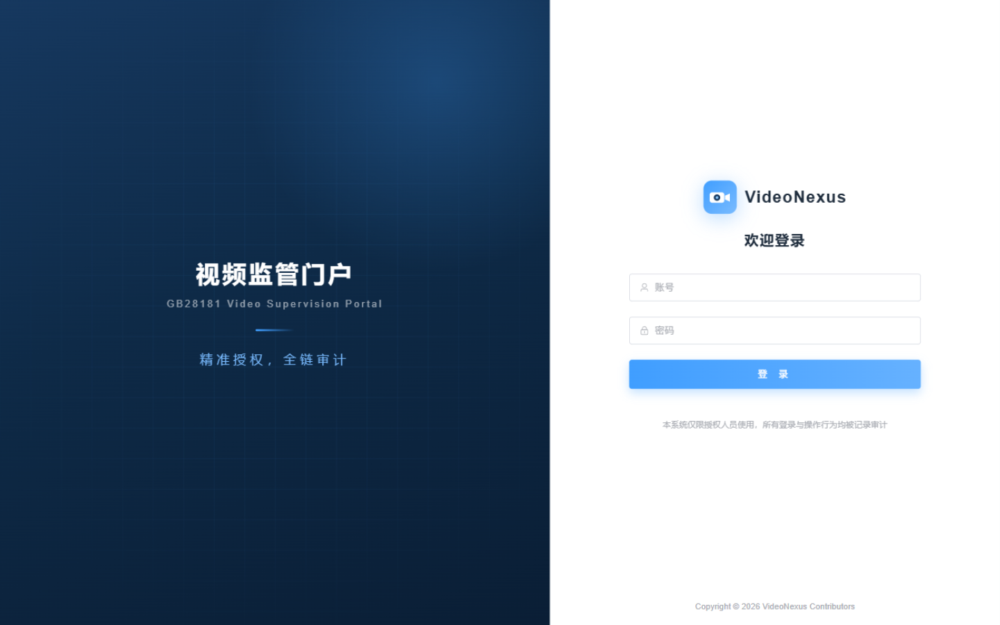
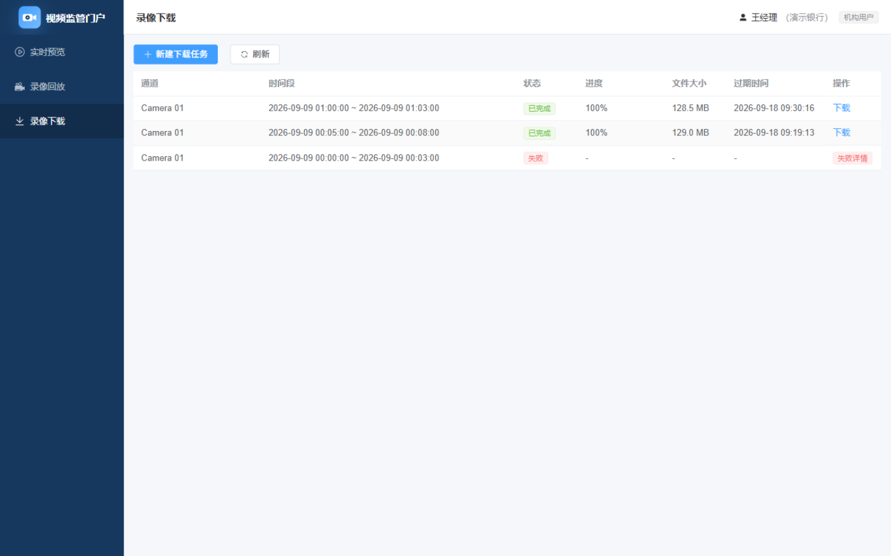

# VideoNexus · GB28181 视频监管门户

[](./LICENSE)
[](https://www.python.org/)
[](https://nodejs.org/)
[](https://fastapi.tiangolo.com/)
[](https://vuejs.org/)

一个面向多机构的最小视频监管门户：用户经 HTTPS 登录后**只能访问被授权的摄像头通道**，可实时预览（动态水印）、按时间段回放录像、发起录像下载任务。

视频能力（信令、拉流、转协议）完全复用现有的 **WVP-GB28181-pro + ZLMediaKit**，本门户只做四件事：**账号、授权、审计、下载编排**。WVP 保持原样、仅内网访问，两者版本互不影响。

> A minimal multi-tenant video supervision portal for GB28181 cameras. It authenticates users, enforces **per-channel authorization** (live / playback / download with validity windows), signs stream URLs bound to the login session, orchestrates asynchronous recording downloads, and keeps an **append-only audit trail**. Streaming is powered by WVP-GB28181-pro + ZLMediaKit, which stay internal-only and unmodified.

---

## 目录

- [功能特性](#功能特性)
- [架构](#架构)
- [安全设计](#安全设计)
- [界面截图](#界面截图)
- [目录结构](#目录结构)
- [快速开始](#快速开始)
- [配置项](#配置项)
- [对接要求与前置条件](#对接要求与前置条件)
- [测试](#测试)
- [常见问题](#常见问题)
- [使用声明](#使用声明)
- [许可与致谢](#许可与致谢)

---

## 功能特性

**面向机构用户**

- 实时预览：H5 播放（Jessibuca ws-flv / http-flv），播放页叠加动态水印（用户 + 所属机构 + 秒级时间，四角轮换）
- 录像回放：按时间段查询设备侧录像段，支持拖动进度、倍速（0.25/0.5/1/2/4/8）
- 录像下载：提交通道 + 时间段生成异步下载任务，完成后限时下载（进度、文件大小、过期时间可见）
- 只可见被授权的通道：通道树按授权过滤，未授权的通道既不显示也无法通过接口访问

**面向管理员**

- 机构管理：机构（租户）信息、启用状态、IP 白名单、并发播放上限、下载存储配额
- 账号管理：手工创建账号（无自助注册）、重置密码、锁定/解锁、停用即时踢下线
- 通道台账：定时从 WVP 同步设备与通道，维护对外展示别名
- 授权管理：按用户逐通道配置「实时 / 回放 / 下载」三个开关与有效期（谁授权给谁、何时收回全部留痕）
- 审计查询：按人 / 机构 / 通道 / 时间 / 动作检索，一键导出 CSV
- 下载任务总览：全机构任务状态与存储占用

**工程特性**

- 播放地址由门户签发（短时效 token + 绑定登录会话），播放请求经 Nginx `auth_request` 逐次校验；鉴权失败写审计（可用于发现地址外泄）
- 设备能力自适应：如某型号设备不支持回放暂停/恢复，首次实测失败后自动标记，前端置灰按钮并给出提示
- 本地开发无需 Nginx：`DEV_STREAM_PROXY=true` 时由后端承担同样的鉴权与转发职责（与生产共用同一套校验逻辑）
- 单机部署形态：SQLite（WAL）起步，切换 MySQL 只需替换连接串；一键 Docker Compose

## 架构

```
用户浏览器（公网唯一入口 443）
        │
      Nginx（portal-web 容器）
      ├── /                     → Vue3 SPA 静态资源
      ├── /api/                 → 门户后端 FastAPI（portal-backend 容器）
      ├── /stream/              → ZLM（auth_request 校验通过后反代，ws-flv / hls）
      └── /protected-download/  → 录像文件内部下发（X-Accel-Redirect + 限速）
        │
   门户后端（SQLite / MySQL，/data 卷）
   ├── 账号 · 机构 · 通道授权 · 审计 · 播放会话 · 下载任务
   └── WvpClient（API Key → 内网 WVP REST）
        │ 内网
   WVP(仅内网) ── ZLM(仅内网)
```

两条关键链路为什么这样设计：

1. **播放链路**：门户校验授权 → 调 WVP 点播/回放接口 → 拿到内部的 `app/stream` 标识 → 改写成门户域名下的短时效签名地址 → 浏览器请求该地址时由 Nginx 子请求回门户鉴权 → 通过后反代到 ZLM。原始 ZLM 地址永不下发，用户无法拿到可外传的直链。
2. **下载链路**：下载无法同步完成，做成异步任务 —— 调 WVP 倍速下载 → 轮询进度 → 从 ZLM 拉取 MP4 落盘 → 生成限时下载入口 → 到期自动清理。

## 安全设计

| 维度 | 做法 |
| --- | --- |
| 数据权限 | 用户↔通道授权表（实时/回放/下载 + 有效期），**所有视频操作在服务端校验**，不依赖前端隐藏 |
| 播放地址 | 短时效随机 token，绑定「用户 + 播放会话 + stream」，地址离开登录会话即失效 |
| 播放校验 | Nginx `auth_request` 对每次播放请求（含 HLS 分片）回源校验会话与授权 |
| 网络暴露面 | 只有门户 Nginx 暴露 443；WVP 与 ZLM 端口不对公网开放 |
| 登录安全 | bcrypt 哈希、连续失败锁定、可选机构 IP 白名单、登录接口限流 |
| 下载管控 | 单次时段上限、并发任务上限、机构存储配额、下发限速、到期自动清理 |
| 审计 | append-only：登录、播放、回放、下载、授权变更、账号管理全程留痕；可按条件检索并导出 |
| 水印 | 播放页叠加用户 + 机构 + 秒级时间（四角轮换、防前端删除），用于威慑与追溯 |

## 界面截图

登录页（左右分栏品牌布局，不含任何真实监控画面）：



录像下载任务（状态、进度、文件大小、过期时间）：



> 出于隐私考虑，仓库内**不包含**含真实视频画面的截图，详见 [CONTRIBUTING.md](./CONTRIBUTING.md)。

## 目录结构

```
backend/     FastAPI 后端：账号/机构/授权/审计/播放/回放/下载编排 + WVP 客户端
  app/api/         路由（auth / channels / play / playback / download_tasks / admin / internal / dev_proxy）
  app/services/    业务服务（wvp 客户端、stream_auth 流校验、grants 授权、download_worker、channel_sync、audit）
  app/models/      SQLAlchemy 模型
  alembic/         数据库迁移
  tests/           pytest（含越权矩阵、设备能力、下载链路）
frontend/    Vue3 前端：实时预览 / 录像回放 / 录像下载 / 管理端；Jessibuca 本地 vendor
deploy/      Docker Compose 编排、Dockerfile、Nginx 模板、备份脚本、部署文档
scripts/     第 0 期 WVP API 验证脚本（对接现网前先跑一遍）
```

## 快速开始

### 0. 环境要求

- Python 3.12+、Node 22+
- 已部署的 **WVP-GB28181-pro（≥ 2.7.x，并已创建 API Key）** 与 **ZLMediaKit**
- 摄像头/录像机已通过 GB28181 注册到 WVP，实时预览与录像查询在 WVP 侧可用

### 1. 对接前验证（强烈建议）

先用脚本把 WVP 的能力边界摸清楚，避免联调时误判：

```bash
cd scripts
pip install -r requirements.txt
cp wvp_config.example.json wvp_config.json     # 填 WVP/ZLM 地址与密钥
python verify_channels.py                      # 设备与通道列表
python verify_play.py                          # 点播与流地址探测
python verify_record_query.py                  # 录像段查询
python verify_playback.py                      # 回放与暂停/拖动/倍速
python verify_download.py                      # 下载全链路（耗时较长）
```

详见 [scripts/README.md](./scripts/README.md)。

### 2. 本地开发（无需 Nginx）

```bash
# 后端
cd backend
python -m venv .venv
.venv/Scripts/pip install -r requirements.txt   # Linux/macOS: .venv/bin/pip
cp ../deploy/.env.example .env                   # 填 WVP/ZLM 地址与密钥
# 本地没有 Nginx，需让后端代为承担 /stream/ 的鉴权与转发：
#   在 .env 中设置 DEV_STREAM_PROXY=true
.venv/Scripts/python -m uvicorn app.main:app --port 9000

# 前端
cd frontend
npm install
npm run dev                                      # http://localhost:5173（/api 与 /stream 已代理到 9000）
```

首次启动会自动创建管理员（`INITIAL_ADMIN_USERNAME`，默认 `admin`），**首次登录强制修改密码**。

### 3. 生产部署（Docker Compose）

```bash
cd deploy
cp .env.example .env         # 填 WVP/ZLM 地址、密钥、域名与管理员初始密码
./certs/gen-selfsigned.sh    # 内网测试可用自签证书；正式环境替换为你的证书文件
docker compose build
docker compose up -d
```

完整步骤（证书、备份恢复、升级、防火墙、FAQ）见 [deploy/README.md](./deploy/README.md)。公网只需开放 443，WVP/ZLM 保持内网。

## 配置项

所有配置通过环境变量注入（本地放 `backend/.env`，生产放 `deploy/.env`），完整注释版见 [deploy/.env.example](./deploy/.env.example)。

**基础**

| 变量 | 默认 | 说明 |
| --- | --- | --- |
| `DATA_DIR` | `./data` | 数据目录（SQLite 与下载文件） |
| `DATABASE_URL` | 空 | 留空则用 `sqlite+aiosqlite://{DATA_DIR}/portal.db`；切 MySQL 填 `mysql+asyncmy://...` |
| `TZ` | `Asia/Shanghai` | 时区（审计时间戳口径） |

**会话与登录**

| 变量 | 默认 | 说明 |
| --- | --- | --- |
| `JWT_SECRET` | 空 | 会话签名密钥，**生产必填**（`openssl rand -hex 48`） |
| `JWT_TTL_HOURS` | `2` | 会话有效期（滑动续期） |
| `PUBLIC_HTTPS` | `true` | 决定签发 `ws://` 还是 `wss://` 播放地址；本地开发设 `false` |
| `SINGLE_SESSION` | `false` | `true` 时同一账号新登录会踢掉旧会话 |
| `LOGIN_MAX_FAILURES` | `5` | 连续失败次数上限 |
| `LOGIN_LOCK_MINUTES` | `30` | 触发上限后的锁定时长 |
| `INITIAL_ADMIN_USERNAME` / `INITIAL_ADMIN_PASSWORD` | `admin` / 空 | 首次启动创建的管理员；密码留空则随机生成并打印一次 |

**WVP / ZLM**

| 变量 | 默认 | 说明 |
| --- | --- | --- |
| `WVP_BASE_URL` | `http://127.0.0.1:18080` | WVP 地址，建议直连后端端口（避开反向代理对响应体的改写） |
| `WVP_API_KEY` | 空 | WVP 管理端创建的 API Key（**优先**，长效免续期） |
| `WVP_USERNAME` / `WVP_PASSWORD` | 空 | 未配 API Key 时的回退账号（401 自动重登） |
| `WVP_REQUEST_TIMEOUT` | `70` | WVP 点播/回放为异步接口，需覆盖其超时 |
| `ZLM_DOWNLOAD_BASE_URL` | 空 | ZLM 的可达 HTTP 入口：用于改写下载直链、本地开发时代理播放流 |
| `ZLM_SECRET` | 空 | ZLM 的 api secret（下载接口需要时附带） |

**下载任务**

| 变量 | 默认 | 说明 |
| --- | --- | --- |
| `DOWNLOAD_SPEED` | `4` | 向设备请求的下载倍速（部分设备会忽略，见 FAQ） |
| `DOWNLOAD_MAX_DURATION_HOURS` | `4` | 单次下载的录像时段上限 |
| `DOWNLOAD_MAX_RUNNING_PER_USER` | `2` | 每用户并发进行中的任务数上限 |
| `DOWNLOAD_POLL_SECONDS` | `10` | 进度轮询间隔 |
| `FILE_RETENTION_DAYS` | `7` | 下载文件保留天数，到期自动清理 |
| `ORG_DEFAULT_QUOTA_GB` | `50` | 机构下载存储配额默认值 |

**通道同步与开发**

| 变量 | 默认 | 说明 |
| --- | --- | --- |
| `CHANNEL_SYNC_MINUTES` | `5` | 从 WVP 同步设备/通道的间隔 |
| `PLAY_SESSION_MAX_HOURS` | `12` | 播放会话最长存续，超时由清理任务关闭 |
| `DEV_STREAM_PROXY` | `false` | **仅本地开发**：由后端承担 `/stream/` 鉴权与转发（生产交给 Nginx，保持 `false`） |

## 对接要求与前置条件

- **WVP 版本 ≥ 2.7.x**：需要 API Key 功能（管理端「用户 / API Key」创建，`app` 名称任意）。若版本较老，可退回账号密码模式（`WVP_USERNAME` / `WVP_PASSWORD`），由后端自动重登。
- **录像必须存在于设备/NVR 侧**：回放与下载依赖 GB28181 的录像查询（`gb_record/query`）与下载（`Download`），需摄像头/NVR 支持并有录像计划。
- **ZLM 的 HTTP 入口需可达**：门户 Nginx 反代播放流、后端拉取下载文件都依赖它。若 ZLM 的 80 端口未映射到宿主机，可借道 WVP 自带 Nginx 的 `/rtp/` 与 `/index/api/` 代理（把 `ZLM_DOWNLOAD_BASE_URL` 指向 WVP Nginx 即可）。
- **`Stream_IP` 配置**：WVP 生成流地址/下载直链时使用的 IP。若配置为 `127.0.0.1`，WVP 自身的前端从其他机器将无法播放；本门户不受影响（自行签发播放地址，并会改写下载直链 host）。
- **编码格式**：H.264 直播/回放开箱可用；H.265 取决于浏览器与播放器（Jessibuca 走 wasm 软解），建议接入前实测，必要时在 ZLM 侧转码。
- **设备不支持回放暂停/恢复**：部分型号（如某些 NVR）会在 WVP 侧固定报错，本门户会自动标记该通道并置灰按钮，不影响播放与拖动/倍速。

## 测试

```bash
cd backend && .venv/Scripts/python -m pytest tests/ -q
```

覆盖重点：

- **越权矩阵**：机构用户对被授权/未授权通道执行 实时、回放、录像查询、下载 的组合校验（含授权过期）
- **播放流鉴权**：合法 token 放行、伪造 token / 无会话 / 无 cookie 拒绝并留审计
- **设备能力**：暂停失败后自动标记并在响应中体现 `capabilities`，设备恢复后自愈
- **下载链路**：任务创建的前置校验（时段上限、并发上限）、异步完成、文件下发、审计链完整
- **认证**：登录成功/失败/锁定、改密、停用踢下线

CI（GitHub Actions）会在 push / PR 时运行后端测试与前端构建，见 [.github/workflows/ci.yml](./.github/workflows/ci.yml)。

## 常见问题

**Q：播放器一直显示「加载中…」，画面出不来**
播放器的解码器（`decoder.js` / `decoder.wasm`）路径不对。本项目已通过 `frontend/src/components/VideoPlayer.vue` 的 `decoder` 选项显式指向 `public/vendor/jessibuca/decoder.js`；若你替换了播放器版本，请确认 `public/vendor/jessibuca/` 下的文件完整。

**Q：本地开发时点播放返回 403 / 一直连不上**
本地没有 Nginx，需要两处配置同时正确：
1. 后端 `.env` 中 `DEV_STREAM_PROXY=true`（由后端承担流鉴权与转发）；
2. `frontend/vite.config.js` 的代理 **不要**设置 `changeOrigin: true`——否则后端会把播放地址生成为 `127.0.0.1:9000`，而浏览器的登录 cookie 属于 `localhost`，跨主机不会携带。

**Q：下载任务报「资源未找到」或进度到 90% 就不再增长**
这是 WVP 的进度语义：其 progress 按「请求倍速」估算，而不少设备（如某些 NVR）**忽略倍速按 1 倍速回传**，于是 WVP 会提前拆除会话、进度接口返回 404——但设备仍在传输。本项目已兼容：进度只用于展示，完成判定改为「下载直链出现」或「云端录像表出现该流的新文件」，因此任务仍会正常完成（耗时按实际倍速走）。

**Q：回放画面超过 1 小时会断流**
若播放流借道 WVP 自带 Nginx 的 `/rtp/` 代理，其 `proxy_read_timeout` 默认为 3600s。需要更长回放请在 WVP 侧调大该超时，或把 ZLM 的 HTTP 端口直接映射出来（门户配置 `ZLM_UPSTREAM` 指向它，本项目 Nginx 已设 12 小时超时）。

**Q：暂停/恢复按钮是灰的**
说明该设备不支持 GB28181 回放的暂停/恢复（WVP 侧 `pauseRtpCheck` 固定失败），系统首次实测失败后自动标记并置灰。播放、停止、拖动、倍速均不受影响。

**Q：能否多台 ZLM / 高并发**
WVP 支持多 ZLM 节点与集群，本门户通过 WVP 统一访问即可扩展；MVP 形态面向中小规模（数十路并发观看），更大规模建议把数据库切到 MySQL 并水平扩展 Nginx。

## 使用声明

本项目是**视频监管领域的技术工具**，仅用于**合法、经授权**的场景：

- 部署与使用者应确保对所接入的摄像头、录像及个人影像信息拥有合法权限，并遵守所在国家/地区的法律法规（如个人信息保护、数据安全、视频监控管理相关规定）
- 请勿将本项目用于未经授权的监视、跟踪或任何侵害他人合法权益的用途
- 项目作者不对任何滥用行为承担责任；使用者应自行完成合规评估（等保、数据留存期限、审计要求等）

## 许可与致谢

本项目以 [MIT 许可证](./LICENSE) 开源，可自由使用、修改与商用（保留版权声明）。

站在以下优秀项目的肩上：

- [WVP-GB28181-pro](https://github.com/648540858/wvp-GB28181-pro) —— GB28181 信令与设备管理平台
- [ZLMediaKit](https://github.com/ZLMediaKit/ZLMediaKit) —— 流媒体服务器
- [Jessibuca](https://github.com/langhuihui/jessibuca) —— 浏览器端流播放器
- [FastAPI](https://fastapi.tiangolo.com/) · [SQLAlchemy](https://www.sqlalchemy.org/) · [Vue 3](https://vuejs.org/) · [Element Plus](https://element-plus.org/) · [Vite](https://vitejs.dev/)
